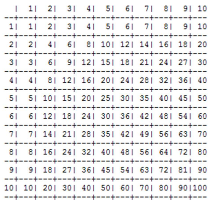

# Задача 1. Таблица умножения
Необходимо написать программу, выводящую на экран таблицу умножения.
Входной параметр –размер таблицы, указывается в консоли пользователем.
Форматирование –в точности как в примере ниже (пример для размера 10).

Размер первого столбца считается отдельно
Должна быть возможность ввода размера таблицы с клавиатуры. Можно ввести любой размер от
1 до 32.
Сделать нормальное форматирование при размерах 3, 5, 32. Программа должна подгонять
размер клеток под размер наибольшего числа в таблице.